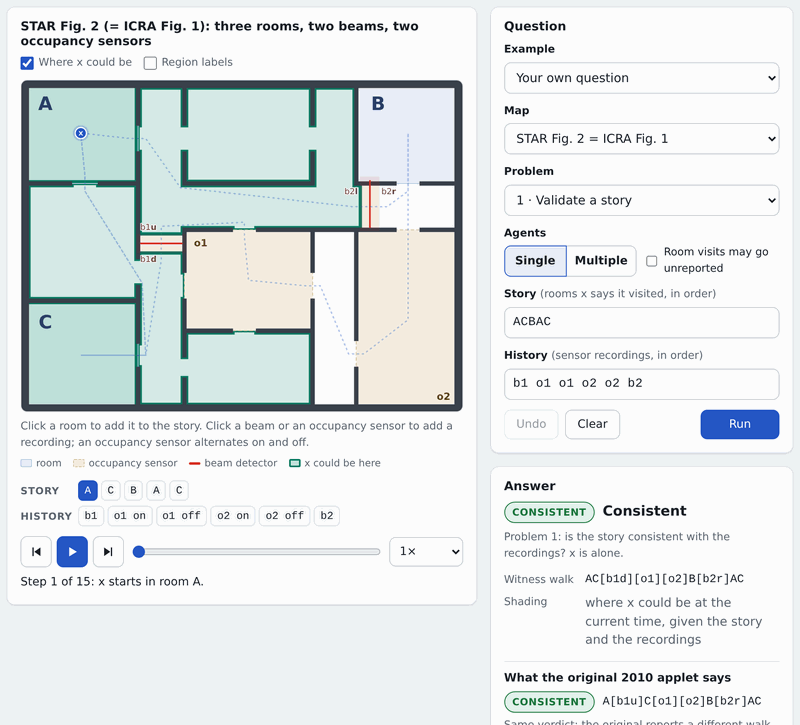
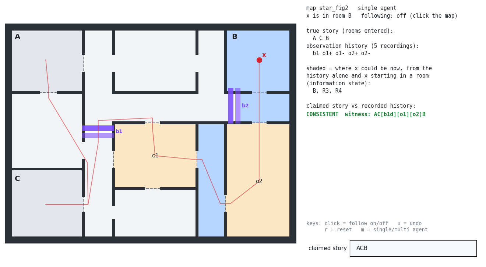

# Cyber Detectives

Check an agent's story against what a sparse network of beam detectors and occupancy
sensors recorded.

[](https://ru-arcl.github.io/cyber-detectives/)

**Live demo: <https://ru-arcl.github.io/cyber-detectives/>** (above: the story ACBAC on the
map of STAR Fig. 2 against three recording histories).

## The idea

An agent x, a robot or a person, tells a story: the rooms it visited, in order. The building
has a few simple sensors. A beam detector records that someone crossed it, and an occupancy
sensor records when its region becomes occupied and when it becomes empty again. No sensor
says who triggered it, and most of the building is not observed at all. Could the story be
true? In "Cyber Detectives" (WAFR 2010) we showed that this can be decided efficiently: the
recordings cut time into intervals, each interval induces a connectivity subgraph of the
environment, and a dynamic program over the chained subgraphs decides whether some path of x
visits exactly the story's rooms and explains the recordings. This works for a single agent,
and also when other agents, who tell no story, may trigger the sensors too.

In the ICRA 2011 paper we built the same check as a finite automaton composed from the map
and the recordings, and used it for three relaxations: the story and the recordings cover
different time intervals (Problem 2), the story leaves out visits (Problem 3: shortest
consistent super-story), and the story contains errors (Problem 4: consistent story with the
fewest edits). This repository is a new, tested implementation of both papers in Python and
JavaScript (the browser demo), with an exact port of our original Java applet code for
comparison. The engine searches the automaton implicitly, with at most (n+1)(m+1) states per
place on the map for a story of n rooms and m recordings.


*(a) The map of STAR Fig. 2. (b) Two recording histories for the story ACBAC. (c, d) Where x
could be between recordings (`possible_positions`): beams and the occupancy regions that are
off act as walls until a recording opens one of them.*

## What's here

| Path | Contents |
|---|---|
| [`src/cyber_detectives/`](src/cyber_detectives/) | Python package (stdlib only): maps, engine (Problem 1), Problems 2-4, paper-literal constructions, geometry, matplotlib viewer, CLI, port of the original Java code (`compat/`) |
| [`docs/`](docs/) | browser demo ([`index.html`](docs/index.html), `js/`, `css/`), [`DESIGN.md`](docs/DESIGN.md) (semantics and API), [`notes/`](docs/notes/) (paper examples, errata, bugs in the original), [`media/`](docs/media/) (the README images and the scripts that make them) |
| [`tests/`](tests/) | pytest suite, JS tests (`tests/js/`), fixtures from the papers, recorded outputs of the original (`fixtures/golden/`), Python/JS parity fixtures |
| [`tools/`](tools/) | fixture and demo-data generators, headless browser check of the demo, reference build of the original Java code (`reference/`) |

## Quick start

```bash
pip install .
```

Python, with the example of STAR §2.3 (map of STAR Fig. 2: rooms A, B, C, beams b1, b2,
occupancy sensors o1, o2; story eq. (1), recordings eq. (2) and eq. (3)):

```pycon
>>> from cyber_detectives import builtin_map, validate, closest_story, possible_positions
>>> m = builtin_map("star_fig2")
>>> r = validate(m, "ACBAC", "b1 o1 o1 b2 o2 o2")        # single agent (default)
>>> r.consistent
False
>>> print(r.reason)
every recording can be explained, but at most 3 of the 5 story elements can be visited in order (story element 4, A, cannot follow)
>>> r = validate(m, "ACBAC", "b1 o1 o2 b2 o2 o1", agents="multi")
>>> r.consistent, r.path_string()                         # a witness walk of x
(True, 'AC{o1}{o2}B{o2}{o1}AC')
>>> validate(m, "ACBAC", "b1 o1 o1 o2 o2 b2").path_string()
'AC[b1d][o1][o2]B[b2r]AC'
>>> c = closest_story(m, "ACBAC", "b1 o1 o1 b2 o2 o2")     # Problem 4
>>> c.story, c.edits
(['A', 'C', 'B'], 2)
>>> possible_positions(m, "b1 o1 o1 b2 o2 o2")            # where x can be, per time slot
[['A', 'C', 'R1', 'R2'], ['A', 'C', 'R1', 'R2'], ['o1'], ['A', 'C', 'R1', 'R2'], ['B', 'R4'], ['o2'], ['B', 'R3', 'R4']]
```

In a path, `[b1d]` means x crossed beam b1 from its `d` side, `[o1]` that it passed through
occupancy region o1, and `{o1}` that it walked through o1 while another agent kept it active.
The full API, including `validate_intervals` (Problem 2) and `shortest_superstory`
(Problem 3), is in [`docs/DESIGN.md`](docs/DESIGN.md).

The command line (exit status 0 = consistent, 1 = inconsistent or no solution, 2 = bad
input):

```console
$ cyber-detectives validate --map star_fig2 --story ACBAC --history "b1 o1 o1 o2 o2 b2"
consistent
path: AC[b1d][o1][o2]B[b2r]AC
$ cyber-detectives validate --map icra_fig2 --story ABDEC --history "b1 b3 o2 o2 b4"  # exit 1
inconsistent
reason: no walk consistent with the story so far can explain recording 5 (b4 A); at most 4 of 5 story elements were accounted for before it
$ cyber-detectives closest --map icra_fig2 --story ABDEC --history "b1 b3 o2 o2 b4"
consistent
story: A B D D C
edits: 1 (substitute E at 3 by D)
path: A[b11]B[b31]D[o2]D[b41]C
```

Other subcommands: `intervals --case N` (Problem 2), `superstory` (Problem 3), `view` (the
viewer below) and `maps`; `--multi` allows other agents, `--json` prints the full result.
`cyber-detectives maps` lists the builtin maps (`star_fig2`, `star_fig1`, `icra_fig1`,
`icra_fig2`); `--map` also takes a map JSON file. `python -m cyber_detectives` is the same
command; from a checkout without installing, run `PYTHONPATH=src python -m cyber_detectives`.

**Browser demo.** Open `docs/index.html` in a browser. It runs from `file://` with no
server, no network access and no build step.

**Viewer.** A matplotlib window: walk x with the mouse, see what the sensors record and where
x could be given the recordings alone, and type a story to check against them:



```bash
pip install '.[viewer]'
python -m cyber_detectives view --map star_fig2
```

**Images.** The scripts next to the README images remake them (byte-identical only with the
same Chrome, fonts, Pillow and matplotlib):

```bash
node docs/media/make_demo_gif.js        # demo.gif: headless Chrome (Node.js >= 22) and Pillow
python3 docs/media/make_concepts.py     # concepts.png and concepts.svg (matplotlib)
python3 docs/media/make_viewer_png.py   # viewer.png (matplotlib)
```

**Tests.**

```bash
python3 -m pytest -q          # Python tests (needs pytest); also runs npm test if node is on PATH
npm test                      # JS engine vs. the Python parity fixtures (Node.js >= 18.1, no dependencies)
node tools/demo/check.js OUT  # the demo in headless Chrome (Node.js >= 22; screenshots in OUT)
```

The golden fixtures pin `compat="original"` to outputs recorded from the original Java code;
[`tools/reference/`](tools/reference/README.md) rebuilds that code (pinned JDK 8) and compares
it with the port on fresh random inputs.

## Differences from the original

Our original applet code ([arc-l/cyber-detective](https://github.com/arc-l/cyber-detective))
solves Problem 1, single and multi-agent, on the hard-coded STAR Fig. 2 map. The default
mode here uses corrected semantics (stated in [`docs/DESIGN.md`](docs/DESIGN.md)); it agrees
with the original wherever the original is right. `validate(..., compat="original")` (CLI:
`--compat original`) runs a line-by-line port of the original instead and reproduces these
bugs, crashes included ([`docs/notes/original-bugs.md`](docs/notes/original-bugs.md)):

- B1: multi-agent false negative, a deactivation loses the agent's progress.
- B2: the witness path depends on `HashSet` iteration order.
- B3: the witness path can contain more crossings than recordings.
- B4: path reconstruction throws instead of returning `null`.
- B5: histories that no agent can produce are accepted.
- B6: applet, an unknown story letter crashes and poisons later runs; bad sensor tokens are dropped.
- B7: latent issues (edge-id collision, a beam deactivation counted as a crossing, hard-wired start in A, unchecked invariants).
- B8: single-agent false positive, the story may end before the last recording.
- B9: the multi-agent validator prints a full subgraph per state.
- B10: applet clicks, a beam strip is hit as room B; stale vertices after Reset.

**Paper errata.** Re-deriving every example of both papers turned up an index error in STAR
Algorithm 3, a missing term in ICRA Algorithm 2 (as printed it accepts inputs that have no
answer), false results for one-room stories in both, no well-formedness check of a
single-agent history in STAR, a Problem 2 case-2 procedure and a §V-B length claim in ICRA
that fail on counterexamples, figure defects and typos. ICRA also drops STAR's rule that every
room visit is reported; we keep it by default, and `unreported_visits=True` drops it. Details
and counterexamples:
[`docs/notes/paper-examples-star.md`](docs/notes/paper-examples-star.md) §9 and
[`docs/notes/paper-examples-icra.md`](docs/notes/paper-examples-icra.md) §7.

**New code.** ICRA Problems 2-4 had no original implementation; they are new here, as are
the JavaScript engine and the demo.

**Provenance.** The STAR Fig. 2 geometry and connectivity come from the original applet code
(arc-l/cyber-detective, BSD-3-Clause); the ICRA Fig. 2 geometry was measured from the paper's
figure. See [`docs/notes/map-geometry.md`](docs/notes/map-geometry.md).

## Citing

```bibtex
@inproceedings{YuLaValle2010CyberDetectives,
  author    = {Jingjin Yu and Steven M. LaValle},
  title     = {Cyber Detectives: Determining When Robots or People Misbehave},
  booktitle = {Algorithmic Foundations of Robotics IX},
  editor    = {David Hsu and Volkan Isler and Jean-Claude Latombe and Ming C. Lin},
  series    = {Springer Tracts in Advanced Robotics},
  volume    = {68},
  pages     = {391--407},
  publisher = {Springer-Verlag},
  address   = {Berlin Heidelberg},
  year      = {2010}
}

@inproceedings{YuLaValle2011StoryValidation,
  author    = {Jingjin Yu and Steven M. LaValle},
  title     = {Story Validation and Approximate Path Inference with a Sparse Network of
               Heterogeneous Sensors},
  booktitle = {2011 IEEE International Conference on Robotics and Automation (ICRA)},
  pages     = {4980--4985},
  address   = {Shanghai, China},
  month     = may,
  year      = {2011}
}
```

## License

BSD-3-Clause, see [`LICENSE`](LICENSE). Copyright (c) 2015-2026, Rutgers Algorithmic Robotics
and Control Group.
